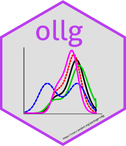

# ollg 
[](https://github.com/dmazarei/ollg/actions/workflows/R-CMD-check.yaml)
[](https://cran.r-project.org/package=ollg)
[](https://cran.r-project.org/package=ollg)
[](https://cran.r-project.org/package=ollg)
[](https://cran.r-project.org/package=ollg)
[](https://www.gnu.org/licenses/gpl-3.0.en.html)

The R package *ollg* : Computes the pdf, cdf, quantile function, hazard function and generating random numbers for Odd log-logistic family (OLL-G). This family have been developed by different authors in the recent years.


## Installation
You can install the **stable** version from
[CRAN](https://cran.r-project.org/package=ollg).

```s
install.packages('ollg', dependencies = TRUE)
```

You can install the **development** version from
[Github](https://github.com/dmazarei/ollg)

```s
# install.packages("remotes")
remotes::install_github("dmazarei/ollg")
```

## To cite package `ollg` in publications use:
  D Mazarei, H Haghbin, M Alizadeh (2022). _ollg: Computes some Measures of OLL-G Family of Distributions
  _. R package version 1.0.0,
  <https://cran.r-project.org/package=ollg>.

A BibTeX entry for LaTeX users is

  @Manual{ollg,
    title = {ollg: Computes some Measures of OLL-G Family of Distributions},
    author = {Danial Mazarei and Hossein Haghbin and Morad Alizadeh},
    year = {2022},
    note = {R package version 1.0.0},
    url = {https://cran.r-project.org/package=ollg}
  }


## License

This package is free and open source software, licensed under GPL-3.
